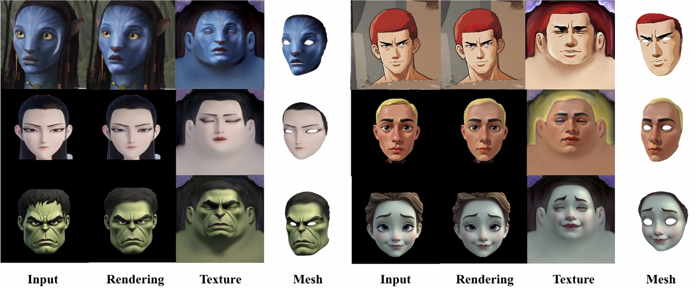
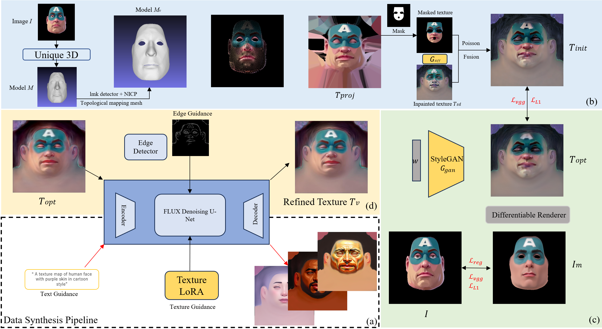
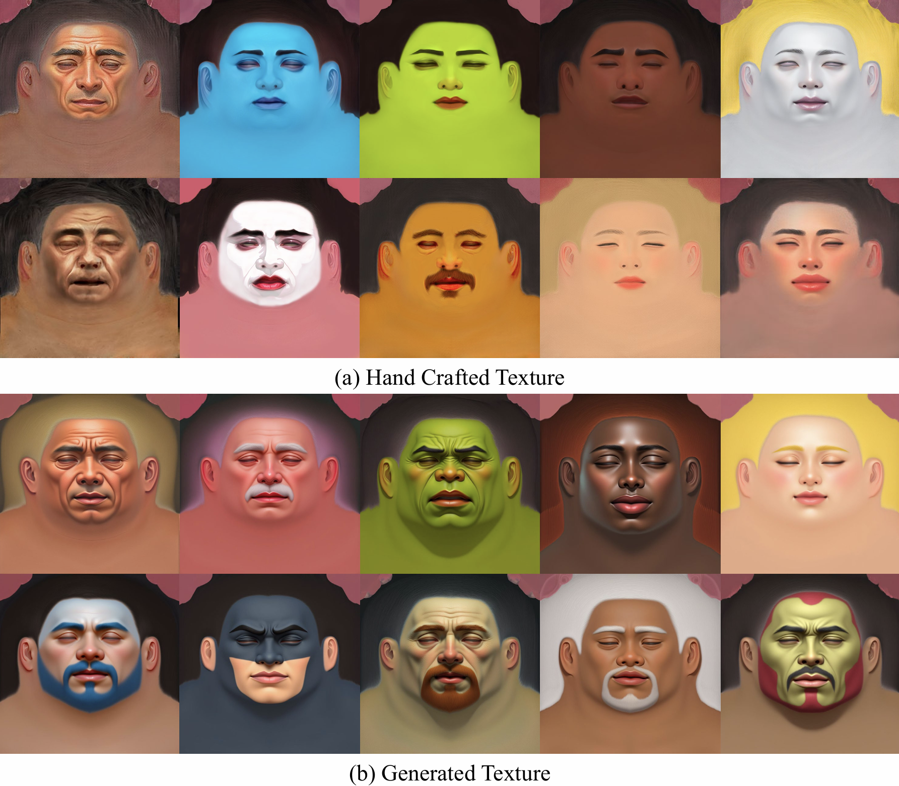

<br>
<p align="center">
  <h1 align="center"><strong>AvatarTex: High-Fidelity Facial Texture Reconstruction from Single-Image Stylized Avatars</strong></h1>
  <h3 align="center">🔥 3DV 2026 🔥 </h3>
  <p align="center">
    <a href="https://www.semanticscholar.org/author/Yuda-Qiu/51152863" target="_blank">Yuda Qiu</a><sup>1*</sup>&emsp;
    <a href="https://github.com/XZT24" target="_blank">Zitong Xiao</a><sup>1*</sup>&emsp;
    <a href="https://yiweizuo.github.io/" target="_blank">Yiwei Zuo</a><sup>1</sup>&emsp;
    <a href="https://www.linkedin.com/in/yezisheng/" target="_blank">Zisheng Ye</a><sup>1</sup>&emsp;
    <a href="https://scholar.google.com/citations?user=Ec6QLl0AAAAJ&hl=en" target="_blank">Weikai Chen</a><sup>3</sup>&emsp;
    <a href="https://dblp.org/pid/60/8294" target="_blank">Xiaoguang Han</a><sup>1,2</sup>
    <br>
    <sup>1</sup>SSE, CUHK-Shenzhen&nbsp;&nbsp;
    <sup>2</sup>Fnii, CUHK-Shenzhen&nbsp;&nbsp;
    <sup>3</sup>Independent Researcher&nbsp;&nbsp;
    <sup>*</sup>Equal Contribution (Alphabetical Order)
  </p>
</p>


<div id="top" align="center">

[](https://arxiv.org/abs/2511.06721)

</div>

<div align="center">
  
</div>

---

## 🔥 News
- **[2025-11]** Our paper was accept by 3DV2026 ! 🥳 
- **[2025-11]** We release the [paper](https://arxiv.org/abs/2511.06721) for **AvatarTex**.
- **[2026-05]** Texhub is released!
- **[2026-05]** Reconstruction code is released.

---

## ⭐ Overview
**AvatarTex** is a high-fidelity facial texture reconstruction framework capable of generating both stylized and photorealistic textures from a single image.
Our key insight is that:
1) While **diffusion** models excel at generating diversified textures, they lack explicit UV constraints,
2) Whereas **GANs** provide a well-structured latent space that ensures style and topology consistency.
   
By integrating these strengths, AvatarTex achieves high-quality topology-aligned texture synthesis with both artistic and geometric coherence.

---

## 📖 Framework
<div align="center">
  
</div>

**AvatarTex** is a **Diffusion-to-GAN-to-Diffusion** framework that consists of four key components:

**(a) Dataset Construction:** We introduce TexHub, a multi-style facial texture dataset built upon the <a href="https://github.com/czh-98/REALY/tree/master/HIFI3D%2B%2B" target="_blank">Hifi3D++</a> topology. The dataset consists of artist-created base texture assets together with diffusion-model-generated augmented data. TexHub provides strong data support for multi-style face reconstruction tasks. Some visualization results from TexHub are shown below:
</div>
<div align="center">
  
</div>

**(b) Texture Initialization:** AvatarTex first reconstructs facial geometry using open-source face reconstruction models (<a href="https://github.com/csbhr/FFHQ-UV" target="_blank">FFHQ-UV</a> or <a href="https://wukailu.github.io/Unique3D/" target="_blank">Unique3D</a> + <a href="https://github.com/wuhaozhe/pytorch-nicp" target="_blank">Nicp</a>), and then projects the reliable regions of the input image onto the mesh to obtain partial textures. A diffusion model is subsequently employed to complete the missing regions, producing an initialized texture.

We recommend referring to our CVPR 2026 paper, <a href="https://github.com/XZT24/OMGTex" target="_blank">OMGTex</a>, which introduces a more robust and efficient initialization approach that eliminates the need for the cumbersome geometry reconstruction process.

**(c) Texture Correction:** Inference-based initialized textures may exhibit discrepancies from the input image in fine details, making the subsequent optimization process necessary. As discussed in our paper, the texture distribution in diffusion latent space is highly non-uniform, which often leads to issues such as abrupt jumps and optimization collapse during refinement, making the optimization process challenging.

In contrast, optimization in the StyleGAN latent space is not only more computationally efficient, but also significantly more stable. Within the StyleGAN space, the optimization process of AvatarTex is divided into two stages. In the first stage, we reconstruct the initialized texture in the StyleGAN latent space. In the second stage, we further refine texture details by employing a differentiable renderer to compute the loss between the rendered texture and the input image.

**(d) Texture Refinement:** While the optimized texture is semantically well aligned with the input image, it may still exhibit blurring due to the limitations of StyleGAN. To further enhance high-frequency details, we apply a diffusion-based repainting strategy.

Specifically, we perform SDEdit-based image-to-image translation by adding noise to the VAE latent of the optimized texture. During diffusion sampling, UV layout consistency is maintained using LoRA adapters and Canny-edge-guided ControlNet constraints, following our texture synthesis pipeline. This yields the final high-fidelity texture map.


---

## 📝 TODO
- \[x\] Release paper and github page.
- \[x\] Release the StyleGAN ckpt for Texhub.
- \[x\] Release the example code on how to use Texhub.
---

## 📚 Getting Started
Thanks for waiting! We have released Texhub, please download from the following link: 
<a href="https://drive.google.com/file/d/1F9rtvIYg7ZgTrASFyloTjGBHf9qTKSJU/view?usp=drive_link" target="_blank">Texhub</a>. 

Due to copyright and security concerns associated with directly releasing the TexHub texture dataset, we instead release the trained StyleGAN checkpoint. This checkpoint is trained on a  collection of multi-style texture data curated and created by us. Compared with models trained solely on real texture datasets, it demonstrates significantly stronger expressive capability. Moreover, it can be readily integrated into existing advanced face reconstruction frameworks. We provide an example demonstrating how to use TexHub. You may follow this example to integrate TexHub into other facial reconstruction frameworks, such as <a href="https://github.com/csbhr/FFHQ-UV" target="_blank">FFHQ-UV</a>.

## Environment Setup
Please configure the base environment according to the <a href="https://github.com/XZT24/AvatarTex/blob/main/environment.yml" target="_blank">environment.yml</a>, as it provides the required dependencies for using the TexHub checkpoint. In addition, to implement face reconstruction frameworks, <a href="https://github.com/NVlabs/nvdiffrast/tree/main" target="_blank">nvdiffrast</a> is often essential. Please follow the instructions provided in the linked repository for installation and setup. If you encounter any issues, please refer to the environment setup instructions of <a href="https://github.com/NVlabs/stylegan3" target="_blank">Stylegan3</a>, as our environment configuration is built upon it.

## Reconstruction Example

The `optimize.py` script implements a simple TexHub-based facial texture reconstruction pipeline, corresponding to the Texture Correction stage described above. The `example` directory provides the necessary sample files for reconstruction.

After setting up the environment and properly configuring all required paths, run the reconstruction as follows:

```bash
python optimize.py
```
## Geometry Reconstruction
In real-world facial reconstruction tasks, optimization-based 3D Morphable Models (<a href="https://github.com/csbhr/FFHQ-UV/blob/main/RGB_Fitting/step2_fit_processed_data.py" target="_blank">Example Scripts</a>) are commonly used for facial geometry reconstruction. However, when handling multi-style inputs with highly diverse shapes and exaggerated expressions, 3DMM-based methods often struggle to produce accurate geometry.

This limitation not only reduces the expressiveness of the reconstructed mesh, but also negatively affects downstream texture reconstruction, since texture optimization typically relies on projecting the mesh into image space to compute pixel-level reconstruction losses against the input image.

A practical alternative is to leverage recent general-purpose 3D generative models (e.g., <a href="https://wukailu.github.io/Unique3D/" target="_blank">Unique3D</a>) to estimate facial geometry, followed by <a href="https://github.com/wuhaozhe/pytorch-nicp" target="_blank">Nicp</a> for topology alignment. Compared to 3DMM-based reconstruction, this pipeline produces more detailed and accurate geometric structures.

In the `example` directory, `unique3d.obj` and `hifi.obj` correspond to the facial geometry before and after topology alignment, respectively.
To further obtain high-quality facial geometry suitable for integration into game engines or video rendering pipelines, we recommend using professional tools such as <a href="https://faceform.com/wraporiginal/" target="_blank">Wrap</a> for NICP optimization. This approach typically yields the highest reconstruction quality. The file `warp_example.obj` in the `example` directory demonstrates such a result. Compared to `hifi.obj`, it preserves the same topology while exhibiting more refined geometric details.

Finally, to fundamentally address texture reconstruction failures caused by imperfect geometry, our follow-up work, <a href="https://github.com/XZT24/OMGTex" target="_blank">OMGTex</a>, decouples geometry reconstruction from texture reconstruction, enabling more robust and efficient facial texture synthesis.


---

## 📬 Contact
If you have questions about the paper, feel free to open an issue or contact:
- **Zitong Xiao**: `120090766@link.cuhk.edu.cn`

---

## 🔗 Citation
If you find our work helpful, please cite:

```bibtex
@article{qiu2025avatartex,
  title={AvatarTex: High-Fidelity Facial Texture Reconstruction from Single-Image Stylized Avatars},
  author={Qiu, Yuda and Xiao, Zitong and Zuo, Yiwei and Ye, Zisheng and Chen, Weikai and Han, Xiaoguang},
  journal={arXiv preprint arXiv:2511.06721},
  year={2025}
}

